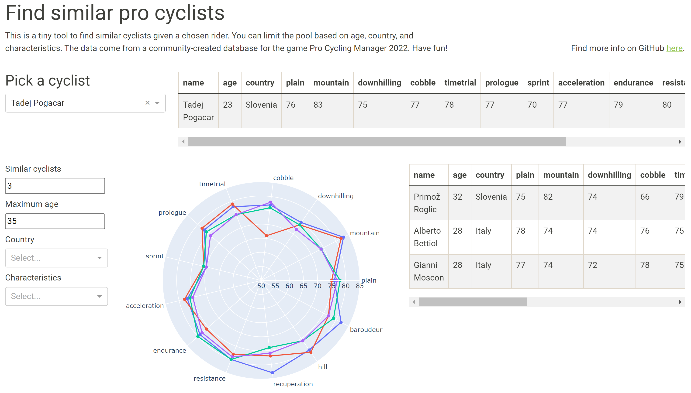

## What?
A tiny [app](https://find-a-similar-pro-cyclist.herokuapp.com/) to find similar cyclists given a chosen rider. The selection can be filtered based on age, country, and rider characteristics.

  

**Note**: Since November 28, 2022, the free Heroku resources are sadly not available anymore. Don't worry, you can still enjoy the app locally!

## Why?
This little tool has several possible applications:
- Gaming (e.g. Pro Cycling Manager or Wielermanager)
- Transfers (to replace a certain rider)
- Scouting (to find the next talent within a certain region)
- You can simply use it out of curiosity

There are of course much more advanced tools to use for above purposes, but it can be useful to provide quick and initial guidance.

## How?

### Data
The data come from the community-made [PCM.daily Expansion Pack 2022 u1](https://pcmdaily.com/infusions/pro_download_panel/download.php?did=1145) database (released June 28th, 2022) for the game Pro Cycling Manager (PCM) 2022. Note that as the database is an update from before the Tour de France 2022, it is not the most recent reflection of a rider's capabilities (for example, Jonas Vingegaard is not the strongest climber). The cyclist's statistics remain overall a very good representation.

In the database each rider has 13 characteristics representing various facets of cycling (such as climbing, sprinting, cobblestones, and so on). The stats have been extracted from the database to Excel using this [tool](https://pcmdaily.com/infusions/pro_download_panel/download.php?did=1108), and are the sole basis for comparing riders.

There is another stats dataset under the `data` folder, from the final community-made WorldDB 2021 database for PCM 2020, downloaded from the Steam Workshop. Other databases (and for other PCM versions) can be found when you register on [pcmdaily.com](https://pcmdaily.com/).

### Analysis

The most similar riders are computed using KNN (K nearest neighbors) search. There are only 5000+ riders in the database, so I could use a brute-force approach. The algorithm compares the vector of the 13 characteristics for the chosen rider with the vectors for all riders, and returns the nearest neighbors. Dead simple!

My initial attempt was with the [FAISS library](https://github.com/facebookresearch/faiss), but Heroku (cf. below) doesn't seem to support this library. I based myself on the first example in [here](https://www.pinecone.io/learn/faiss-tutorial/), using the exact L2 norm functionality, to find the riders with the smallest Euclidean distance (thus most similar) versus the base rider. The library is much more powerful, but this use case didn't require more complexity. Related code is found in the `bin` folder.

The plot shown is called a spider (or radar, star, polar) chart, made with the Plotly library.

### App

The tool is a **Python Dash app**. It is my first, and I just started with the official [tutorial](https://dash.plotly.com/installation), then modified along until I reached my desired outcome. My development environment was PyCharm.

It is made available on a free [Heroku](https://www.heroku.com/) server. I followed these [steps](https://www.angela1c.com/posts/2021/09/deploying-dash-apps-to-heroku/), but had to do some obligatory troubleshooting to get it up and running.

Not going to lie, the app is not the prettiest (especially on mobile), but it is functional. To make it prettier, further diving into [this](https://dash-bootstrap-components.opensource.faculty.ai) would be a good resource I think.

## Cool?

If you are interested in expanding the logic, or improving the app('s layout), get in touch! You can read the article on Medium (see top) for more background.
